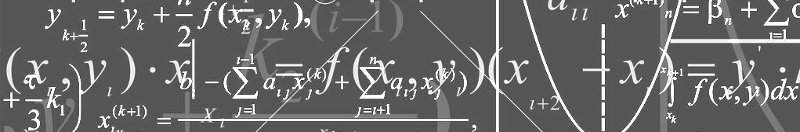
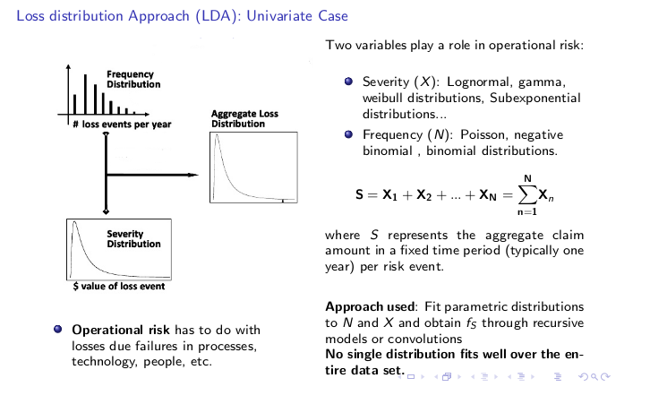
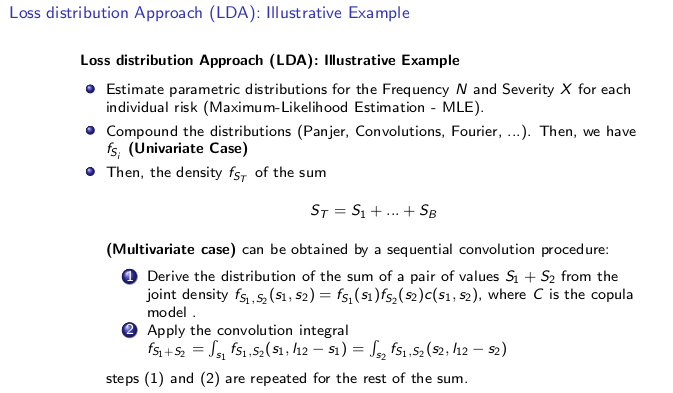
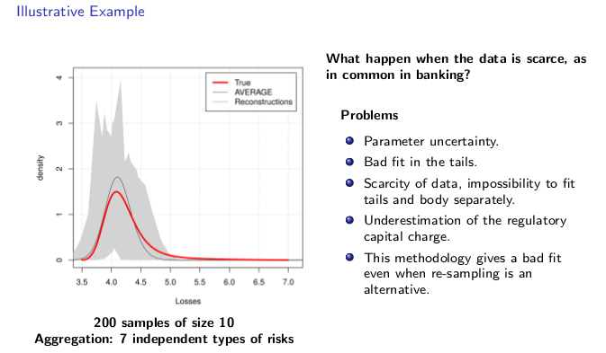
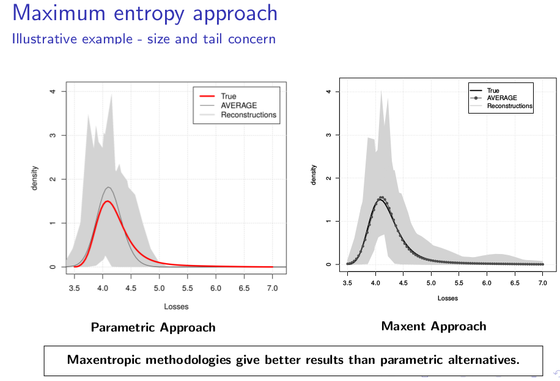
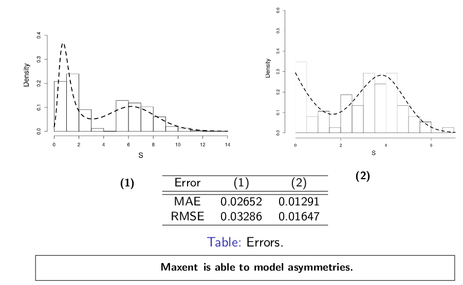
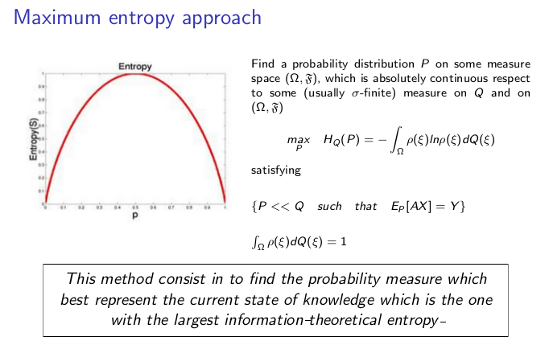
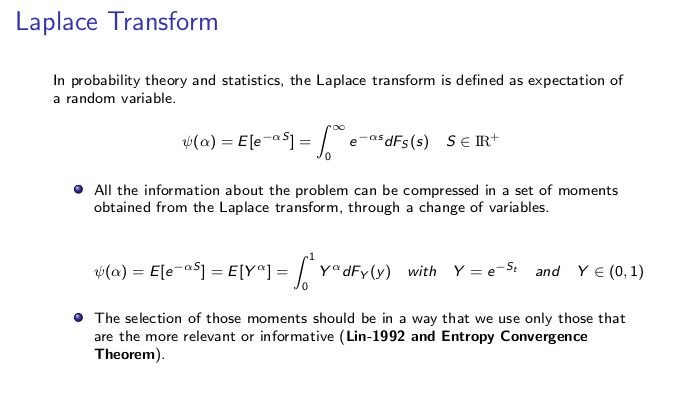
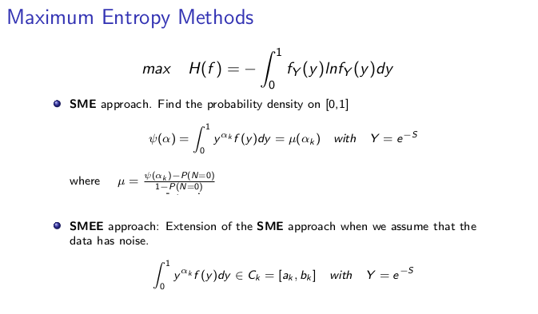

  
  &nbsp;

  \
  \
  
  
  

   \
   
<h4> Maxentropic* Methods in Operational Risk: A Review</h4>
<h5>*entropy (noun), entropic (adjective), entropically (adverb) </h5>

  \
  \
In banking and financial industries, during the last few decades, there has been a collective effort, to develop a conceptual framework to characterize and quantify risk, in particular in Operational Risk, in order to put money aside to cover large - scale losses and ensure in this way the solvency and economic stability of the financial system.

In the field of insurance modeling a similar effort has been done to set premiums and optimal reinsurance levels, using historical data of claims or  losses. The differences between banking and insurance companies lies in the availability of data. Usually, in insurance the data is sufficient for a statistical description of the process, while, in the area of Operational Risk, the sample sizes are always small. So, depending of the given sample size the results may vary widely.

So far, banks use the **loss distributional approach** to determine capital charge through historical data using information about the frequency and severity (loss amount) of losses to estimate the annual aggregate loss for each line and event type.  In this context, annual frequency of losses is usually modelled by Poisson or negative Binomial distributions. Generally, loss data can be fitted to a variety of severity distributions, lognormal, gamma, GDP, etc.

  \
  \
  
  
  

  
  \
  \
  

An important measure used in operational risk is Value-at-Risk, which estimates the worst possible loss event that can occur with a certain probability over a given time period. The regulations establish that the allocated capital should correspond to a 1-in-1000 (or the value that correspond to the quantile 0.999) years worst possible loss event, which is a much larger time period than the window over which banks have been collecting operational loss data (usually between five and fifteen years). 

To calculate regulatory capital, we have  to calculate the distribution of the losses so a quantitative model is required to model the peculiarities of the loss distribution: high kurtosis, severe right skewness and excessive heavy - tailedness. Model this kind of distributions in banking distributions is quite complicated due to the impossibility of model ‘tail events’ because in many cases no data is available to characterize the distribution in the tail, so there is the possibility that the estimates understate the capital that from a regulatory perspective should be avoided. 

On the other hand overestimation is also an issue to take in account in banking due to the opportunity costs of not investing the available capital. The overestimation may occurs when we consider perfectly correlation across risks,  this is the direct sum of losses. Most of the time it is difficult to model correlations between different risk types and/or business units, because banks are quite short of historical data, which implies that reliable estimations of correlation can hardly be extracted from historical data.

So, for the correct estimation of quantiles, the problem to solve is model the distribution in the whole range of interest. 

Motivated by the aforementioned issues, we propose to model the total losses by maximizing an entropy measure. The Maxentropic methodologies that we will mention in this article can handle with the problems discussed above and they can provide a good density reconstruction over the entire range of values.

To better understand the problem consider that a bank use the following methodology:

  \
  \
  
  
  

  
  \
  \

Under this LDA approach there is some flexibility, thus the methodology may vary from bank to bank

Here we apply the approach described before to different samples of size 10 with the same underlying loss process. Clearly ,the results depends of the quality of the data, but it is also influence for the uncertainty in the estimation of the parameters, clearly the principal problem is the bad fit of  the tail where the black swans are.

A potential solution is to model the body and the tail separately but other problems emerges, especially when the data is scarce, in this case fit the tail would be difficult, even impossible to do.

As a consequence, we can see that we have and undestimation of the capital charge, because we have a fit that do not take in account large losses. Observe that even the average of the different estimate densities (resampling method*) give us a bad fit.

<h7> *The resampling methods consist in consider different scenarios each one with its own solution. The definitive  solution is obtained by averaging the solutions for each of the considered scenarios. </h7> 

  \
  \
  
  
  

  
  \
  \

We use the same example but this time, we solve it with maximum entropy methods, here this methodology provide a density reconstruction over the entire range of values. Clearly, if resampling is an alternative this methodology gives good results

  \
  \
  
 
  
  
   
  

  

  \
  \

In the literature some authors indicate that the loss distribution is not always unimodal, this distributions can present asymmetries that a simple parametric distribution cannot reach. The methodology that we process here can model bimodal distributions. This is another advantage of the maxent methods.

  \
  \

  
  

  \
  \

We can relate the concept of entropy with finance, where the hypothesis that markets respond to the level of uncertainty or the element of surprise is analogous to this concept. In the last decades, entropy, which has its origins in physics, has found important applications in finance, and has been an important tool for portfolio selection, as a measure of the degree of diversification, and more widely in asset pricing, to tackle the problem of extracting asset probability distributions from limited data. You can read more about this in Zhong et. al. (2013), that make a review of the many applications of this concept in finance.

  \
  \
  
  
  

  
  \
  \

This concept was used by Jaynes (1957) for first time as a method of statistical inference in the case of a under-determined problem where it was necessary to choose the probability distribution of a discrete random variable $X$ between all possible distributions, when the available information was the expected value of $X$ and the fact that $p_i  \leq 0$ and $\sum_{i} p_i = 1$, in this case there were infinitely many proper probability distributions satisfying this information. So, through the concept of Shannon entropy he selects the alternative that best represented the given information. The essence of our methodology falls within this framework.

With the maximization of an entropy measure it is possible to find the best non-parametric solution that avoids unnecessary assumptions, without having to insert any structure or correlation beyond the required and that better represents the available information formulated by constraints, in an optimization problem. With this methodology the quality of the results will be linked to the chosen constraints (Gomes-Gonçalves et. al., (2016)).

So, for our problem it is necessary to define some constraints. A good alternative to model the constrains of this kind of problem  is the Laplace transform.

  \
  \
  
  
  

  
  \
  \

The inversion of the laplace transform is one of the methodologies used to determine the aggregate loss distribution, but this transform is not always easily to inverse. But the good thing is that if we set a variable Y on 0 and 1, this leads to the problem of reconstructing a function from a sequence of alpha moments, where the value alpha is fractional and it is chosen in this way because with a few number of moments we can obtain good density reconstruction (entropy convergence theorem)

So, all the information about the problem would be compressed in a set of moments obtained from the laplace transform. In our case we will modelling the distribution of strictly positive losses, so our restriction should guarantee that.

So, through the laplace transform we are going to obtain the distribution of the aggregated losses through two different approximations of maxent methods. The maxent methods that can be considered are...

  \
  \
  
  
  

  
  \
  \

Note that the problem is solved in terms of the Lagrange multiplier lambda. The solution is used to obtain the dual problem, where we minimize this functional through a unsconstrained optimization problem. This problem can be solved by the Barzilai and Borwein (BB) optimization method (gradient descent method), which requires the objective function and the gradient of the function with respect of lambda.

 \
  \

-----

**References**

1.- [Maxentropic and quantitative methods in operational risk modeling. Thesis dissertation, Sep. 2016.](https://core.ac.uk/download/pdf/79176655.pdf) 

2.- [Maxentropic and quantitative methods in operational risk modeling (Presentation)](https://www.slideshare.net/ErikaGomesGonalves/maxentropic-and-quantitative-methods-in-operational-risk-modeling)

3.- [Zhong et. al. (2013). Applications of Entropy in Finance: A Review](http://www.mdpi.com/1099-4300/15/11/4909/pdf)

-----

