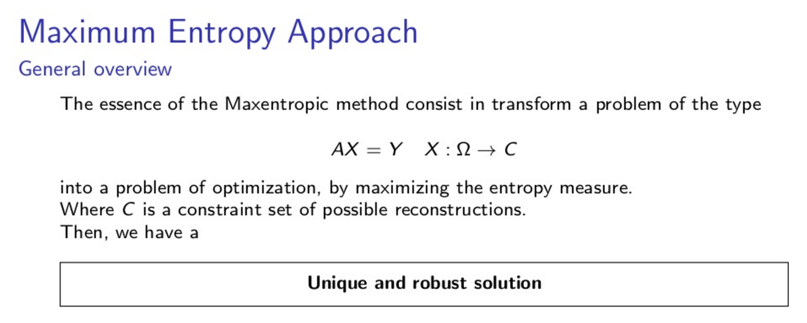

  
  &nbsp;

  \
  \
  
  
  

  
  \
  
<h4> Maxentropic applications in Finance </h4>
<h5>*entropy (noun), entropic (adjective), entropically (adverb) </h5>

  \

 > **Entropy**, in the framework of probability theory is defined as a measure of the degree of uncertainty or unpredictability of a system, where its magnitude certainly depends of the quantity of information available. Anything that we cannot explain is assigned as much uncertainty or maximum entropy as possible.  A good example comes from the field of finance where the hypothesis that markets respond to the level of uncertainty or the element of surprise is analogous to entropy.

 > In the last decades, the concept of entropy that had its original role in statistical physics with the work of Boltzmann and Gibbs, has found important applications in several fields. **This measure has been an important tool for portfolio selection, as a measure of the degree of diversification, and more widely in asset pricing, to tackle the problem of extracting asset probability distributions from limited data**. Zhong et. al. (2013) and Borwein and Zhu (2017) make a review of the many applications of this concept in finance.

 > This concept was used by Jaynes (1957) for the first time as a method of statistical inference in the case of an underdetermined problem, where **it was necessary to choose the probability distribution of a discrete random variable $X$ between all possible distributions**, when the available information was the expected value of $X$ and the fact that $p_i  \leq 0$ and $\sum_{i} p_i = 1$. In this case there were infinitely many proper probability distributions satisfying this information. So, through the concept of Shannon entropy he selects the alternative that best represented the given information.
 
 
 
  
  
  
   
   

  

  \
  \

 
> However, to extend this concept to other problems and fields, with different quantification processes other assumptions are required, according to the nature of the problem.

 > For example, **finding the correct density is quite important in insurance and risk applications**,  for the estimation of Value at Risk (VaR). In this case is usual that risk decision-makers consider parametric assumptions, that in most of the cases incorrectly modeled fat tails and asymmetries that are crucial, without took into account problems related with the quality and availability of the data, which leads to a poor estimation of the risk measures as $VaR$.

 > With the maximization of an entropy measure it is possible to find the best non-parametric solution that avoids unnecessary assumptions, without having to insert any structure or correlation beyond the required and **that better represents the available information formulated by constraints**, in an optimization problem. With this methodology the quality of the results will be linked to the chosen constraints.

 > Using this methodology is possible to solve the **undetermined problem of find the prices of zero coupon bonds from the knowledge of the prices of a few bonds**, even it is possible to extend the problem to the case where the input is a bid-ask interval, where there may be additive errors in the pricing. Also, it is possible to obtain a nonparametric alternative to  methodologies for the calibration of discrete time term structure, as the Black-Derman-Toy and Ho-Lee models used to price derivatives.

 > **The potential of the maxent methodologies is varied**. This methodology can be extended to solve problems in the area of finance, risk, insurance, and applied statistics as extreme value theory, clustering, lifetime value calculations between others applications.

  \
  

---------

**References**

1.- Gomes-Gonçalves, E. and Gzyl, H., Mayoral, S. (2017). [Calibration of discrete time term structure models from coupon bond prices](https://erikapat.github.io/publications.html). Work in progress.

2.- Gomes-Gonçalves, E. (2016). [Maxentropic and quantitative methods in operational risk modeling](https://e-archivo.uc3m.es/bitstream/handle/10016/23791/Tesis_erika_gomes_goncalves.pdf?sequence=1). Thesis dissertation. Universidad Carlos III de Madrid (UC3M).

---------

