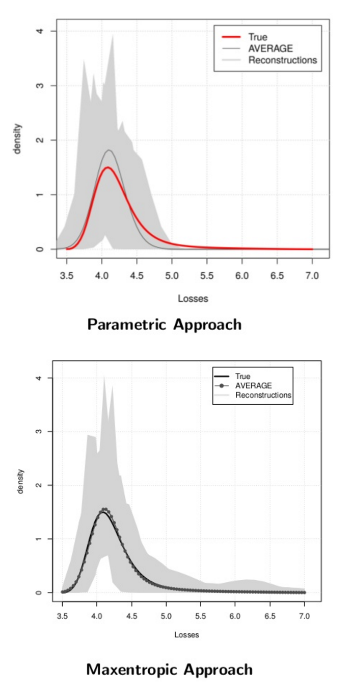

&nbsp;
&nbsp;
<h1><strong> Erika Gomes-Gonçalves </strong></h1> 


<!-- <div class = "row"> -->
<!-- <div class = "col-md-4"> -->

<!-- &nbsp; -->
<!-- &nbsp; -->

<!-- <div></div> -->


<!-- </div> -->
<div class = "col-md-6">

&nbsp;

\
\


Welcome to my personal web page!

<p> Until not so long ago I worked as pre-doctoral researcher at the UC3M, in Madrid, where I did my doctoral research on topics related with the use of **maxentropic methodologies** for the estimation of the capital requirements for banks. The methodology that I used has **several applications** in **insurance (premium calculations), finance(pricing) and statistics (density estimation, clustering, ...)**, between others. I am built this webpage (**still work in progress**) to show my work along, with applications and examples of this methodology (also work in progress). </p>


This webpage is in its initial stage, so there aren't many things on here yet; but you'll find a little bit about my work, figures and articles that I put up here and that are mostly a result of little experiments that I read, hear or perform in the past.

</div>
<!-- imagénes -->

<div class = "row">
<div class = "col-md-4">

&nbsp;
&nbsp;

<!-- body .main-container { -->
<!-- max-width: 1200px; -->
<!-- } -->

<!-- body .main-container { -->
<!-- max-width: 1200px; -->
<!-- } -->

<!-- <div></div> -->
```{r echo=FALSE, message=FALSE, out.height = '40%'}
source('src/density_samplig_graphs.R')
require(pracma)
sampling_prin()
```

<p> * _Click on the colors_  </p>

\
\


</div>


---

