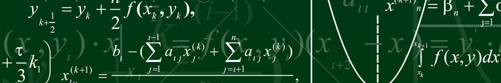

\
\

  

  
   \
  \

<h4> [Optimal Bid Pricing Model]() </h4>
 
   \
 \
 
 In this post we want to solve the problem of setting the prices of several insurance products searching for the optimal strategy, in order to contact those clients who are more likely to buy one of the products that an Insurance company 'X' is offering. The objetive of this post is to search the solution that generates the maximum profit for the company. We will use the ideas developed by Lawrence, 2002.
 
 For this, we have information of sales made in the past along with socieconomic information of those clients that made or not a purchase in the past. From this database only a small percentage of clients have been  contracted one of the products offered. So,  we have variables such as the premium offered (that we will call bid scenarios), the outcome of the bid iteration (win or loss of the sale), the number of products that the clients bought in the past, the socioeconomic status, the number of years that the clients have in the company, price sensitivity of the prospective buyer and socieconomic information.
 

   \
  \
  
 
  
  
   
  
  

  

  \
  \
 
 
We will develop a classification model that using past data allow us to determine which customers has more probability of make a purchase after a call with a bid scenario. Then, we use these results to determine the optimal premium.

Before starting with the mathematical definition of the clasification problem, we will describe some characteristics of the data, this data and some code can be found in ... 

First at all we have missing data, 

   \
  \
  
 
  
  
   
  

  

  \
  \

 
 So we have all the bid iterations and also the outcome (win or loss) ...the winning offer is not necessary determined by the lowest price ...in our database we have several bid scanarious... 
 
 
 ---------

**References**

1.- Lawrence, Richard D. "A machine-learning approach to optimal bid pricing." Computational modeling and problem solving in the networked world (2002): 97-118.

---------