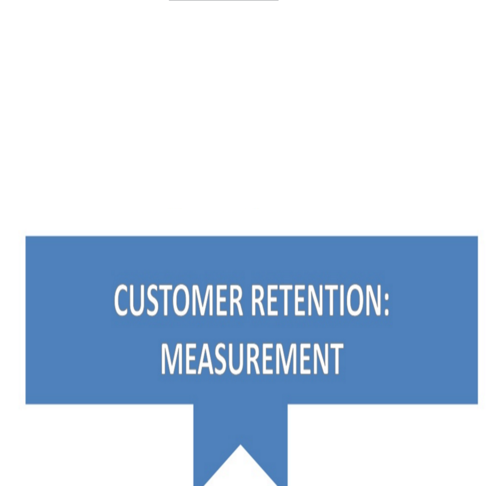
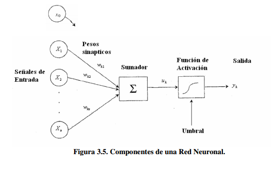
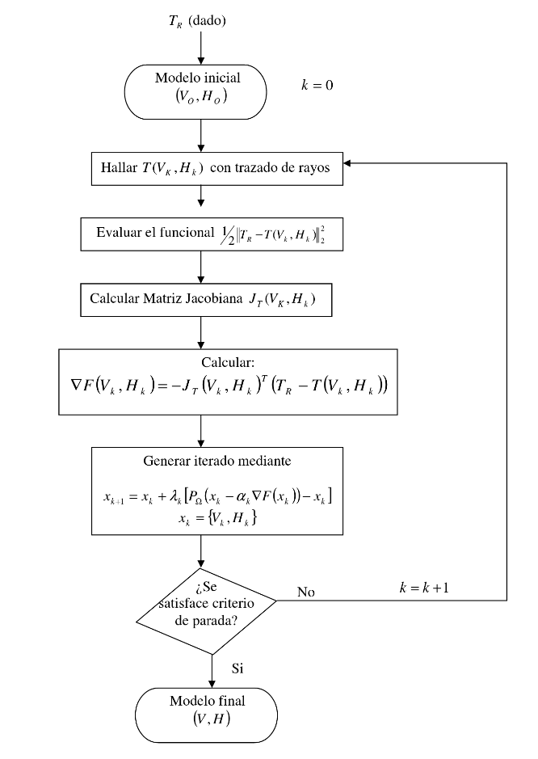

&nbsp;
&nbsp;
<left> <h1> <strong> Resources </strong></h1> </left>

---

 Under construction ... wait a little bit or check my [GitHub repository](https://github.com/erikapat)

&nbsp;

Here, I present a collection of links that might be of interest, these are not directly related with my research, but they are related with things that I did in the past or topics that I want to learn in the future... 

<!-- block -->

&nbsp;
&nbsp;

&nbsp;

&nbsp;

<h2><strong><i>[Customer retention measurement:](http://www.slideshare.net/ErikaGomesGonalves/customer-retention-measurement?ref=http://www.slideshare.net/ErikaGomesGonalves/slideshelf) </i></strong></h2> 

<h5><i> September, 2015 </i></h5>

 Measure the value of a change, model or strategy is not always easy. Requires technical and creative skills. Here I present some ideas that you can find in the extense literature that already exist about experiments. Here, I present several techniques as randomized methods (along with A/B testing used extensively in the industry), natural experiments and quasi experiments along with some examples of applications of those methodologies applied to customer retention. At the end, it is necessary to stay that any solution that you choose should be as simple as possible, on the contrary all your efforts would worth nothing if you cannot explain your ideas in simple words.   

 

 <h6><i>**Key words: **</i></h6>
 
&nbsp;

<!-- block --> <!-- block --> <!-- block --> <!-- block --> <!-- block --> <!-- block --> <!-- block --> <!-- block --> <!-- block --><!-- block -->

<h2><strong><i>[A Comparative Study of Credit Scoring Techniques (Spanish):](http://www.bib.usb.ve/tesis/000149741.pdf) </i></strong></h2> 

<h5><i> </i></h5>

 The project presents a fairly comprehensive comparative study of statistical, optimization and mixed techniques available until the date to address the problem of credit scoring. In the absence of actual data for comparison, we implement an interesting simulation scheme that generates the structure of dependence between the relevant variables through the use of copulas of different kinds. The study allows establishing which methodologies are probably more effective for the problem considered and its findings can be of great interest to financial institutions within and outside the country. R and MATLAB® were used for implanting the methodologies. The methods developed included Bayesian approaches, Fisher linear discriminator, Logistic Regression, Probit, Tobit, Classification Trees, K-nearest neighbor, Linear Programming, Neural Networks, Genetic Algorithms and Support Vector Machines.   

 

 
  <h6><i>**Key words: **</i></h6>
 
&nbsp;

 <!-- block -->
 

 <h2><strong><i>[Estimated speeds and interfaces using seismic data and numerical optimization techniques:](https://github.com/erikapat/optimizador/blob/master/libro-tesis.PDF) </i></strong></h2> 

 This project presents a major computational development that solves the problem of determining the propagation of velocities of seismic waves in the subsurface, as well as determining the locations of the interfaces of the layers that they form, using two fundamental tools, a numerical optimization method known as Spectral Projected Gradient and a Ray Tracing tool that calculate the travel times of seismic waves. The proposed methodology used prior computational developments of both tools were adapted and combined to obtain functional and efficient software, which yielded satisfactory numerical results. All this was done using FORTRAN.  

 

  <h6><i>**Key words: **</i></h6>

---
