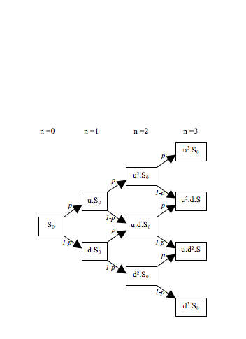
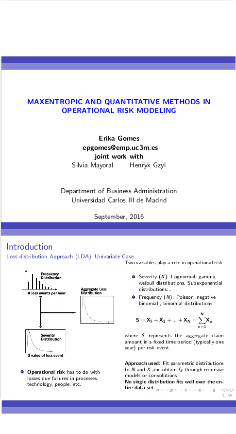
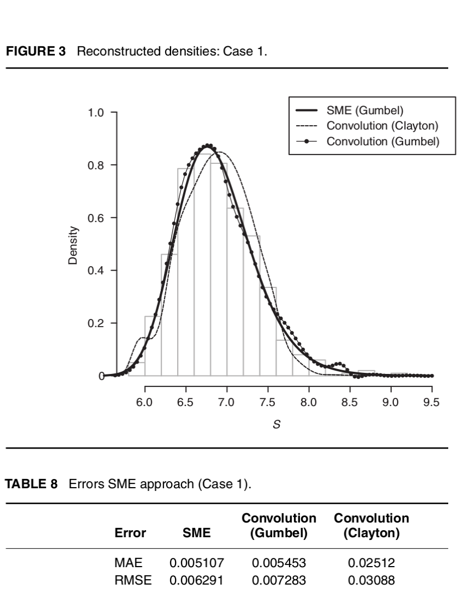
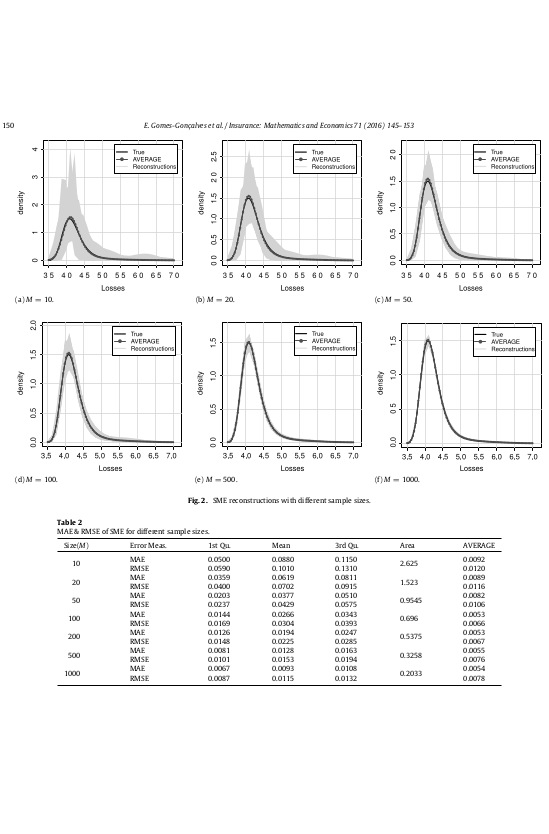
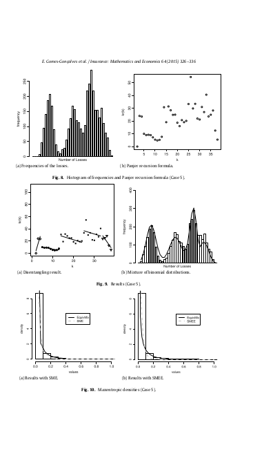
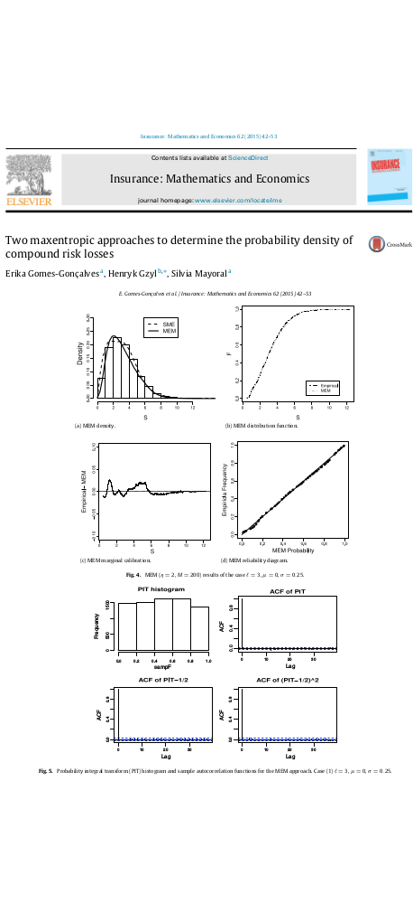
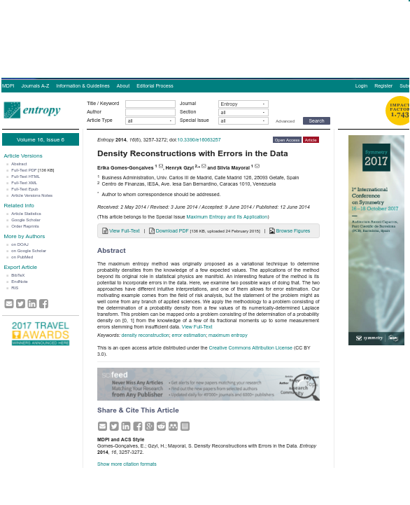
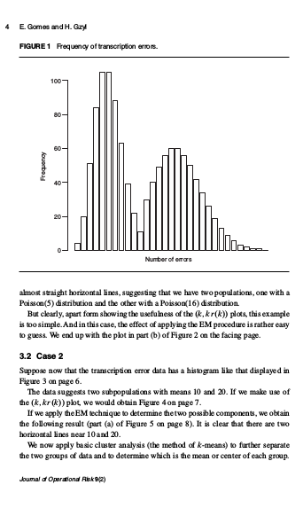

&nbsp;
&nbsp;
<left> <h1> <strong> Publications & Work in progress </strong></h1> </left>

&nbsp;

<h2> I published in several international journals and also I have some work in progress, you can see more details here or in my [Google Scholar page](https://scholar.google.es/citations?user=OT0Ole4AAAAJ&hl=en).</h2>

---

&nbsp;

&nbsp;

&nbsp;

<h2><strong> <i>[Loss Data Analysis: The Maximum Entropy Approach](https://books.buch-findr.de/book/loss-data-analysis/)</i></strong></h2> 
<h8><i> Publisher: De Gruyter, 2019 (Forthcoming Book)</i></h8> 

Operational Risk Assessment is an important tool to mitigate losses. This textbook focuses on loss data analysis using a maximum entropy approach. 

This book contains most of the work developed in my Phd dissertation. This is a project that is still ongoing in this moment. 

 

&nbsp;

---

&nbsp;

&nbsp;

&nbsp;
&nbsp;

<h2><strong> <i>[Calibration of Discrete Time Short Rate Term Structure Models from Coupon Bond Prices](calibrations.html)</i></strong></h2> 
<h8><i> Working paper, 2017 </i></h8> 

 Our recent work consists in the use of maximum entropy methods for the calibration of discrete time term structure models from coupon bond prices. Here, we use maxentropic methods to determine the short rates along to a binomial tree to obtain a non-parametric alternative to the Black-Derman-Toy and Ho-Lee models used to price derivatives.
 
 <h6><i>**Key words: **</i></h6>
 

[[Abstract]](calibrations.html)[[pdf]](https://papers.ssrn.com/sol3/papers.cfm?abstract_id=2976076) [[Blog post]](Maxent_Finance.html)  

<!-- block -->

&nbsp;

&nbsp;

---

<h2><strong> <i>[Maxentropic and quantitative methods in operational risk modeling](thesis.html)</i></strong></h2> 
<h8><i> Thesis dissertation, Sep. 2016 </i></h8> 

 After a while, I finally submitted my PhD thesis. In it, I organised the already published results related with how to apply Maxentropic Methodologies to OP. There, I collected lots of bits and pieces of new ideas that I had lying around (which I hadn't had the time to publish yet).  The potential of the maxent methodologies is varied. This thesis can be extended to solve problems in the area of finance, risk, insurance, and applied statistics (as extreme value theory, clustering, lifetime value calculations), between others applications. 

 

 <h6><i>**Key words: **</i></h6>

[[pdf]](https://e-archivo.uc3m.es/handle/10016/23791)[[Presentation]](http://www.slideshare.net/ErikaGomesGonalves/maxentropic-and-quantitative-methods-in-operational-risk-modeling)[[Blog post]](Maxent_OP.html)[[Software]](https://erikapatcode1234.shinyapps.io/SME_MEM/)

---

<!-- block -->

&nbsp;

&nbsp;

<h2><strong> <i>  [A Maximum Entropy Approach to the Loss Data Aggregation Problem](http://www.risk.net/journal-operational-risk/2450287/maximum-entropy-approach-loss-data-aggregation-problem) </i></strong></h2> 
<h8><i> Published in Journal of Operational Risk, 2016 </i></h8> 

  Here, we briefly discuss how
the Maxentropic method could be used to capture dependencies between random sums in the
last level of aggregation. The results are compared with a standard procedure (the convolution
method) in order to proof how the maximum entropy performs easily with less computational effort. 

 <h6><i>**Key words: **</i></h6>
 
[[pdf]](https://papers.ssrn.com/sol3/papers.cfm?abstract_id=2721018)[[Presentation]](http://www.slideshare.net/ErikaGomesGonalves/a-maximum-entropy-approach-to-the-loss-data-aggregation-problem)[Blog post]

---

<!-- block -->

&nbsp;

&nbsp;

<h2><strong> <i> [Loss data analysis: Analysis of the sample dependence in density reconstruction by maxentropic methods](http://www.sciencedirect.com/science/article/pii/S0167668715302006) </i></strong></h2> 
<h8><i> Published in Insurance: Mathematics and Economics, 2016 </i></h8> 

 At this point, we have concluded that maximum entropy based techniques are rather powerful to determine density distributions in Risk. So, the pending question is: What happen when the data is scarce, as is common in baking?. At this point we know that the maxentropic density depends upon the data used. In this paper, we analyze the variability of the reconstructed densities to examine the impact of this variability on the estimation of  $VaR$ and $TVaR$, which are favored tool of financial regulators for bank capital adequacy, and extensively used in fields such as insurance and fund management.  

 

 
  <h6><i>**Key words: **</i></h6>
[[pdf]](https://www.researchgate.net/publication/308044815_Loss_data_analysis_Analysis_of_the_sample_dependence_in_density_reconstruction_by_maxentropic_methods)[Software][Presentation][Blog post]
&nbsp;

---

<!-- block -->

&nbsp;

&nbsp;

<h2><strong> <i> [Maxentropic Approach to Decompound Aggregate Risk Losses](http://www.sciencedirect.com/science/article/pii/S0167668715001146) </i></strong></h2> 
<h8><i> Published in Insurance: Mathematics and Economics, 2015 </i></h8> 

  We extend the methodology that was called decompounding  in  the paper 'Two maxentropic approaches to determine the probability density of compound risk losses' to separate the risk sources and to identify the statistical nature of the frequency and severity through the use of maximum entropy and clustering methods. 

 

 

 
  <h6><i>**Key words: **</i></h6>
[[pdf]](https://www.researchgate.net/publication/282631687_Maxentropic_approach_to_decompound_aggregate_risk_losses)[[Conference]](https://www.liverpool.ac.uk/media/livacuk/ifam/ime2015/Erika,Gomes,Goncalves.pdf)[[Presentation]](https://www.slideshare.net/ErikaGomesGonalves/maxentropic-approach-to-decompound-aggregate-risk-losses)[Blog post]
&nbsp;

---

&nbsp;

&nbsp;

<h2><strong> <i> [Two maxentropic approaches to determine the probability density of compound risk losses](http://www.sciencedirect.com/science/article/pii/S0167668715000232) </i></strong></h2> 

<h8><i> Published in Insurance: Mathematics and Economics, 2015 </i></h8> 

 Here we studied two maxentropic methodologies called Standard Maximum Entropy method (SME) and Maximum Entropy in the Mean method (MEM) to find the density distribution of aggregated loss data using the Laplace transformation as an input. We considered as example a Poisson-LogNormal process. This case was chosen because the closed form of the Laplace transform of a Lognormal is not known and neither its compound sum.  Then, to solve this, we considered the numerical form of the Laplace over the simulated data, and we evaluated the results through the use of visualizations and
several tests.
Additionally, in this paper we made the first attempt to  decompose the random sums in its frequency/severity distributions through the use of maxent methodologies. The idea behind this paper is to prove the simplicity and value of the maxent methods for the calculation of the regulatory capital through estimation of Value at Risk ($VaR$) and Tail value at risk($TVaR$).
 

 
  <h6><i>**Key words: **</i></h6>
[[pdf]](http://www.sciencedirect.com/science/article/pii/S0167668715000232) [Software][Presentation][Blog post]
&nbsp;

&nbsp;
---

<!-- block -->

&nbsp;

---

---

&nbsp;

---

<h2><strong> <i> [Density reconstructions with errors in the data](http://www.mdpi.com/1099-4300/16/6/3257)</strong></i></strong></h2>
<h8><i> Published in Entropy, 2014 </i></h8> 

 We examined two possible ways of deal with sample errors, within the framework of the SME method. The differences between the two approaches lay on the output of these methodologies. One of these methods provided an additional output that worked as an estimator of the additive error.  

 <h6><i>**Key words: **</i></h6>
 
[[pdf]](http://www.mdpi.com/1099-4300/16/6/3257/htm)[[Abstract]](https://www.dropbox.com/s/3458wet0a52b4ij/Entropy.pdf?dl=0)[Blog post]
&nbsp;

---

<!-- block -->

&nbsp;

&nbsp;

<h2><strong> <i> [Disentangling frequency models](http://www.risk.net/journal-operational-risk/2350131/disentangling-frequency-models) </i></strong></h2> 
<h8><i> Published in Journal of Operational Risk, 2014 </i></h8> 

This is a short paper that pretends to introduce the first step of a procedure that we develop in the paper <i>Maxentropic Approach to Decompound Aggregate Risk Losses</i>.  The methodology proposed here, try to solve a problem that is particularly common in firms in the early stages of operational risk data modeling,  when the data collection procedure does not distinguish between subpopulations or sources of risk. This methodology that later we call disentangling consists in separate the risk sources and identify the statistical nature of the frequency through the use of models of the type $(a, b, 0)$ and clustering methods like k-means and  EM algorithm, when the number of sources of risk is known. 

 <h6><i>**Key words: **</i></h6>
[[pdf]](http://search.proquest.com/openview/c5cc0b21bb5195a8798c12cd0fa5dd7c/1?pq-origsite=gscholar&cbl=50660) [Software][Presentation][Blog post]
&nbsp;

---
